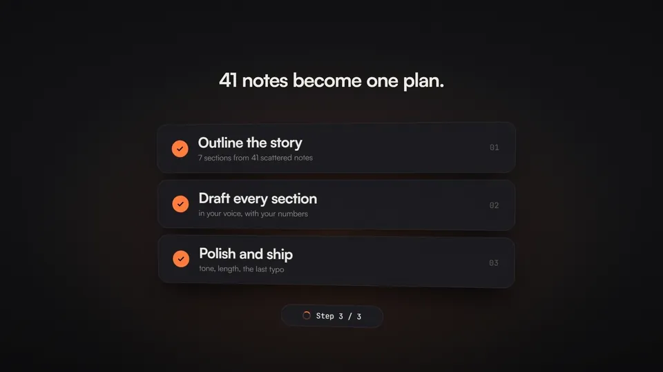
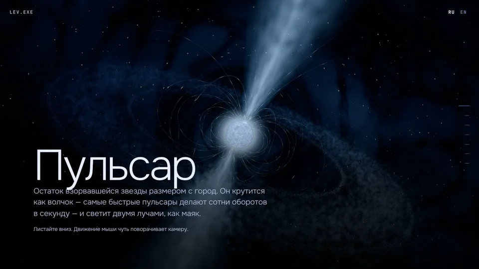

<h1 align="center">LEV.EXE</h1>

  <b>3D-сайты, моушн, логотипы и айдентика для брендов.</b> 
  Работаю из Германии с клиентами из России и СНГ. 
  Design studio of one: 3D websites, motion, logos and identity.

  <a href="https://t.me/frrayzed">Telegram</a> ·
  <a href="mailto:levnew24@gmail.com">levnew24@gmail.com</a>

---

## Что делаю

| Услуга | Что получаете |
|---|---|
| **3D-промосайт** | сайт с живой 3D-сценой, сюжетом на скролле и версией для телефона |
| **Лендинг** | быстрая продающая страница: от первого экрана до заявки |
| **Логотип и айдентика** | знак, шрифты, цвета и правила, чтобы бренд узнавали везде |
| **Моушн** | ролики и анимация логотипа в форматах 16:9, 9:16 и 1:1 |
| **Презентации** | питч-деки и коммерческие предложения, которые хочется дочитать |
| **Соцсети и маркетплейсы** | оформление профиля, посты, карточки товаров |
| **Telegram-боты** | заявки, запись и ответы клиентам без ручной работы |

## Работы

> Концепты: бренды и задачи придуманы, чтобы показать подход. Раздел пополняется.

### Моушн
**Margin — фильм для продукта**

Ролик для приложения заметок: стеклянные 3D-иконки, горизонт планеты и кинетическая типографика.
`Three.js` `GSAP` `рендер кадров с motion blur`

### Сайты
**PULSAR — 3D-сайт о пульсарах**

Научный рассказ в семи главах на русском и английском: камера летит вокруг звезды, а ползунком наклона магнитной оси можно увидеть, почему пульсар мигает.
`Three.js` `GLSL` `Vite` `TypeScript` `Lenis`

## Инструменты

`Three.js` · `GSAP` · `WebGL / GLSL` · `React` · `Vite` · `TypeScript` · `Blender` · `Photoshop` · `CorelDRAW`

## Связаться

Пишите в Telegram **[@frrayzed](https://t.me/frrayzed)** или на **levnew24@gmail.com**. Оплата переводом в рублях, реквизиты в чате.
